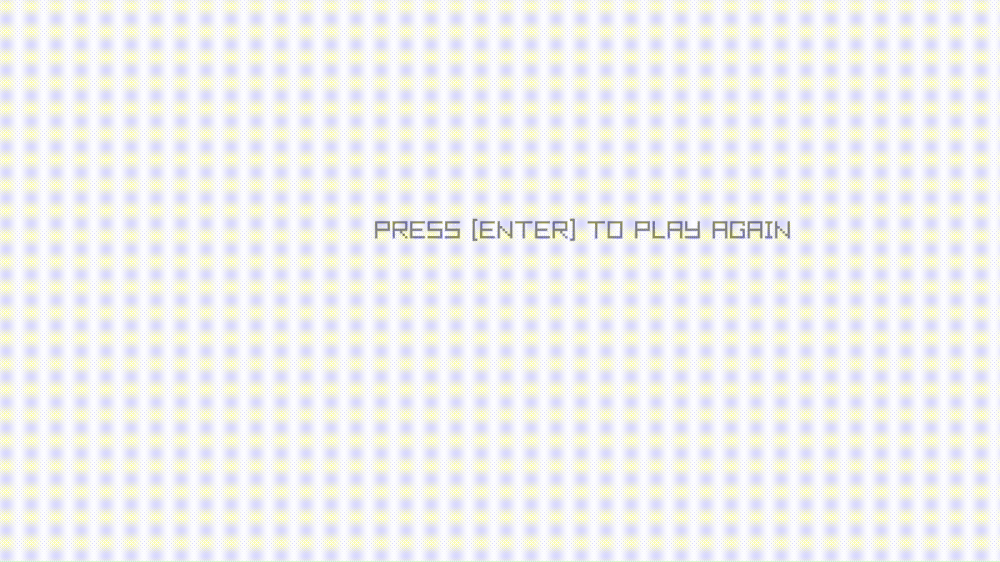

# Snake Game

Un petit projet de jeu Snake développé en [Python], pour s’amuser et pratiquer la programmation.

## Fonctionnalités 
   
   - Déplacement fluide du serpent avec les touches directionnelles
   - Génération aléatoire de la nourriture 🍎
   - Score qui augmente à chaque pomme mangée
   - Gestion des collisions (mur, corps du serpent)
   - Écran de fin de partie avec le score final

